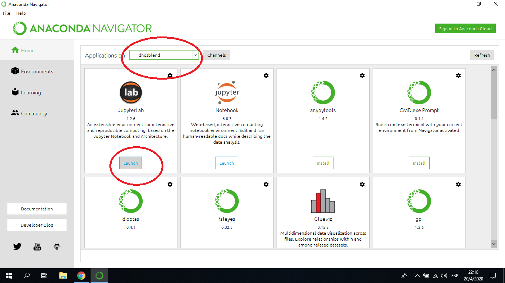

# Data Science Blend

## Instalación paso a paso

Primero bajamos e instalamos:
* git desde https://git-scm.com/downloads
* anaconda desde https://www.anaconda.com/distribution/

Luego, en una carpeta de trabajo, abrimos un emulador de terminal (también conocido como terminal, consola, prompt, cmd) y clonamos este repositorio:

```
git clone https://github.com/Digital-House-DATA/ds_blend_students_2020.git
```

A continuación, desde la misma terminal, creamos y activamos un ambiente de conda:

```
conda create --name dhdsblend python=3.7
conda activate dhdsblend
```

En el nuevo ambiente, instalamos las dependencias requeridas por las notebooks de este repositorio, además de JupyterLab:

```
cd ds_blend_students_2020
conda install --yes --file common/requirements.txt
```

Finalmente corremos JupyterLab para empezar a trabajar:

```
jupyter lab
```

*Nota: para cerrar JupyterLab pueden cerrar la terminal, "matar" el proceso `jupyter lab` o seleccionar el comando `Shut Down` del menu `File`.*

## Mantenimiento

Una vez clonado el repositorio e inicializado el ambiente, podemos continuar con el resto del curso desde la misma ubicación, sin necesidad de reinstalar todo para cada clase.

Para ello entramos en la carpeta de trabajo, reactivamos el ambiente y reiniciamos JupyterLab:

```
conda activate dhdsblend
cd ds_blend_students_2020
jupyter lab
```

Si necesitamos actualizar los contenidos del repositorio podemos hacerlo dentro de la carpeta del mismo mediante:

```
git pull
```

*Nota: si efectuamos cambios locales puede que al hacer el `pull` los archivos actualizados en el repositorio remoto entren en conflicto con las modificaciones locales de los mismos archivos. En ese caso, recomendamos copiar el directorio con el repositorio modificado bajo un nuevo nombre y volver a clonar el mismo (esto no requiere reinstalar el ambiente de conda, son dos aspectos completamente independientes).*

## Interfaz gráfica

Si prefieren ejecutar JupyterLab desde Anaconda Navigator lo pueden hacer, pero primero deben crear e inicializar el ambiente de conda como se indica arriba. Una vez creado el ambiente, tienen que seleccionarlo en el dropdown que aparece en el launcher:


